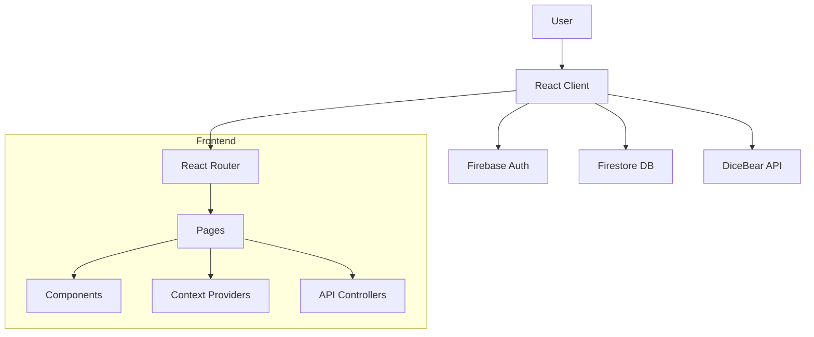

# System Architecture

## Overview
The Anonymous Wall is a **Single Page Application (SPA)** built with **React** (Vite) and powered by **Firebase** for backend services.

### Technology Stack
- **Frontend**: React 18, Vite
- **Language**: JavaScript (ES6+)
- **Styling**: Vanilla CSS (Modularized per component/page)
- **Routing**: React Router DOM v6
- **Backend**: Firebase (Firestore, Authentication)
- **External APIs**: DiceBear (Avatar Generation)

## Architecture Diagram

## State Management
The application uses React Context API for global state management.

### AuthContext
- **Purpose**: Manages user authentication state and profile data.
- **Data**: `currentUser` (Firebase User), `userProfile` (Firestore Data).
- **Actions**: `login`, `logout`, `refreshProfile`, `toggleSave`.

### MessageContext
- **Purpose**: Manages state for the Freedom Wall messages.
- **Data**: `messages` (Array of message objects).
- **Note**: Acts as a cache/fallback for the `Browse` page, which primarily fetches from Firestore.

## External Services

### DiceBear API
- **Endpoint**: `https://api.dicebear.com/9.x/avataaars/svg`
- **Usage**: Generates unique, consistent avatars based on a user's "seed".
- **Logic**: `getAvatarUrl(seed)` helper function.
