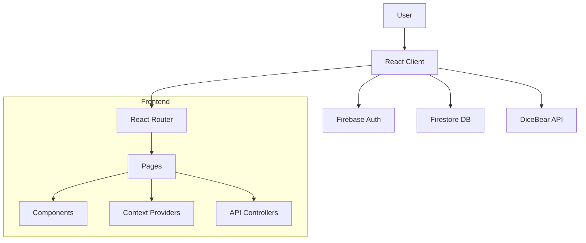

# System Architecture

## Overview
The Anonymous Wall is a Single Page Application (SPA) built with React (Vite) and uses Firebase for backend services.

### Technology Stack
- Frontend: React 18, Vite
- Language: JavaScript (ES6+)
- Styling: Vanilla CSS (modular per component/page)
- Routing: React Router DOM v6
- Backend: Firebase (Firestore, Authentication)
- External APIs: DiceBear (Avatar generation)

## Architecture Diagram


## State Management
The application uses React Context API for global state management.

### AuthContext
- Purpose: Manages user authentication state and profile data.
- Data: `currentUser` (Firebase User), `userProfile` (Firestore Data).
- Actions: `login`, `logout`, `refreshProfile`, `toggleSave`.

### MessageContext
- Purpose: Manages state for the Freedom Wall messages.
- Data: `messages` (array of message objects).
- Note: Acts as a cache/fallback for the Browse page, which primarily fetches from Firestore.

## External Services

### DiceBear API
- Endpoint: `https://api.dicebear.com/9.x/avataaars/svg`
- Usage: Generates unique, consistent avatars based on a user's seed.
- Logic: `getAvatarUrl(seed)` helper function.

## File Map (Frontend)
```
src/
|-- main.jsx                 # Starts React, wraps AuthProvider and MessageProvider, mounts App
|-- App.jsx                  # Router shell, lazy routes, shared layout (Header, Footer, etc.)
|-- pages/
|   |-- Home/                # Landing hero, grid, stats
|   |-- Browse/              # Freedom wall cards and search layout
|   |-- Forum/               # Forum feed, filters, create modal, post cards
|   |   |-- components/      # ForumHeader, ForumFilters, ForumFeed
|   |-- ForumPost/           # Single post view with replies
|   |-- Submit/              # Submit modal wiring
|   |-- Profile/             # Profile layout, history, and form styling
|   |-- AdminDashboard/      # Admin shell, reports, logs
|   |-- About/, Contact/     # Static pages and styles
|   |-- TermsOfService/, PrivacyPolicy/, SecurityPolicy/  # Legal pages
|   `-- NotFound/            # 404 page
|-- components/
|   |-- Header/, Footer/, HeroButton/, MessageCard/, BoardBadge/
|   |-- LoginModal/, ForumPostModal/, ReportModal/, ReportSuccessModal/
|   |-- DeleteConfirmationModal/, LoadingIndicator/, BackToTop/, Stats/
|   `-- ErrorBoundary/       # Shared UI pieces
|-- contexts/
|   |-- AuthContext.jsx      # Firebase auth and profile state/actions
|   `-- MessageContext.jsx   # Message cache for browse
|-- hooks/
|   |-- useTypedLyrics.js    # Animated hero text
|   `-- useStats.js          # Aggregate stats helper
|-- utils/
|   |-- timeUtils.js
|   |-- nameGenerator.js
|   |-- firebaseCollections.js # Collection name map for controllers
|   `-- constants.js         # Nav and shared constants
|-- data/
|   |-- mockForumData.js
|   `-- boardConfig.js
|-- index.css                # Global styles
`-- App.css                  # Layout/theme scaffolding
```

## File Map (Backend)
```
src/backend/
|-- config/
|   `-- firebase.js          # Sets up Firebase for login and saving data
|-- models/
|   |-- PostModel.js
|   |-- ReplyModel.js
|   `-- MessageModel.js      # Defines how posts, replies, and messages are stored
|-- controllers/
|   |-- postController.js    # Creates, lists, and likes posts
|   |-- replyController.js   # Adds and reads replies
|   |-- messageController.js # Adds and reads wall messages
|   |-- reportController.js  # Sends and tracks reports
|   |-- moderationController.js # Helps moderate content
|   `-- userController.js    # Updates and reads user profiles
`-- api/
    `-- avatar.js            # Builds the link for your avatar image
```

## API Surface (Optional)
- Backend controllers are called directly through the Firebase SDK (client-side), not through a custom HTTP server.
- `src/backend/api/avatar.js` builds DiceBear URLs (bottts fallback for anonymous).
